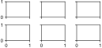
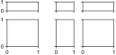

[](https://pypi.org/project/mplex/)
# mplex
A matplotlib extension.

## Installation
```sh
pip install mplex
```

## Examples
```python
from mplex import Grid
# subplots with uniform size and spacing
g = Grid((30, 20), (2, 3), space=(15, 10))
# subplots with non-uniform size and spacing
g = Grid(([35, 20, 35], [10, 30]), space=([20, 10], 10))
```




[More exaples](https://github.com/tkclam/mplex/tree/main/examples)
